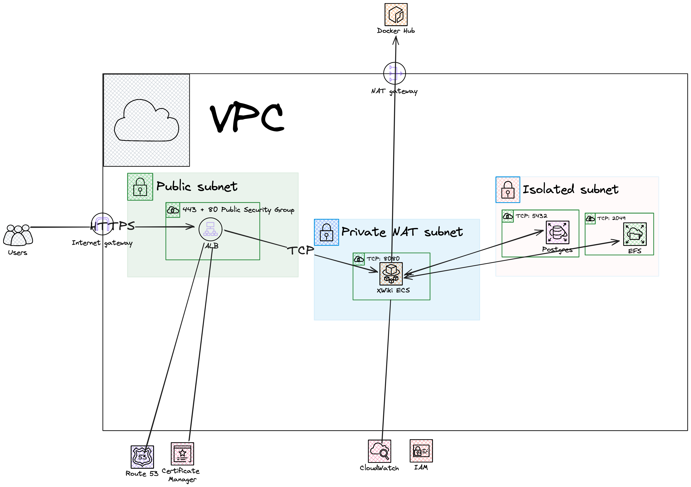

# XWiki in AWS

## How to run

### Install cdk
* ```brew install node``` if NodeJS not installed
* ```npm install -g aws-cdk```
* ```pip install -r requirements```

### Test
```python -m pytest```

### Deploy
Go to the root directory of the repo and run
```cdk deploy```
This stack is Account Agnostic so it can be run with any credentials

This is an AWS showcase task to deploy XWiki Knowledge management system in AWS



## Key Components

### VPC

The VPC configured to have:

* Public
* Private with NAT (with egress access to the Internet)
* Private Isolated Subnet
* Multiple AZ supported for High Availability

### ECS Cluster

The Cluster that is used to spin up the ECS service and can be reused for other services

### Public ALB

It created Public ALB with open access to 443 (HTTPS) and 80 (HTTP) ports
The ALB is used to create Target Groups to ECS Fargate Service

### RDS
XWiki requires Postgres or MySql Db. In this case I use Postgres which is placed in Isolated Subnet.
AWS CDK creates Secret Manager Secret to manage credentials.
Rotation can be set up in addition, but left out for simplicity.

### EFS
XWiki needs static storage. I use EFS and mount the filesystem to ECS task. EFS is located in Isolated Subnet

### ECS Service
Finally,  XWiki provides official Docker image to be used. I Create ECS Service, mount EFS Volume, provide RDS credentials through Secret Manager and AWS CDK creates Target groups, ALB Listener rules.
ECS Tasks are located in Private NAT Subnets because I use Docker Hub to download the image so ECS Agent must have outgoing Internet access.

### ACM
In addition, the HTTPS connection can be set up using existing Route53 Zone.
AWS CDK will create the certificate and Route53 record.